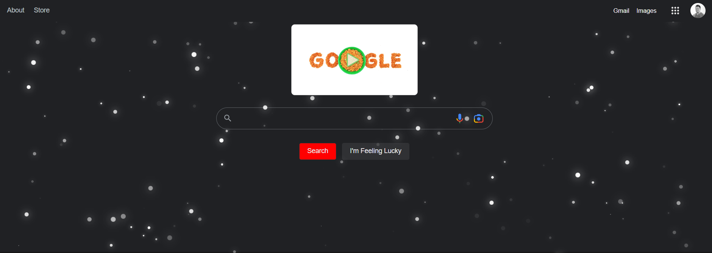

# Girl Guiding UK Hackathon
This repository is to help the girl guiding community and is prepared especially for the  Parbold guides district to help girls get into software development. This project will allow the participants to understanding DOM manipulation with the power of JavaScript injected into a page. During the Hackathon and the skills learned this will allow the guides with the assistance of the leaders to help write code to manipulate a website of their choosing and customise it locally.
Once the event is over we will demo the results and welcome any contributions to this repository. In the end we will discuss the security impacts of malware and keyloggers that can perform a similar function to how custom JavaScript browser extensions could be imposed. 



## Google Chrome Extensions
[Tamper Monkey Chrome Extension](https://chrome.google.com/webstore/detail/tampermonkey/dhdgffkkebhmkfjojejmpbldmpobfkfo?hl=en)


## Google Snowfall 

*File* : GoogleHack.LetItSnow.user.js

Snow falling slowly on a winter night. Probably the most calming and peaceful snowfall effect written in pure JS/CSS. (No SCSS). 

Inspired by: [alphardex](https://codepen.io/alphardex/pen/dyPorwJ) (SCSS Version) and [YusukeNakaya](https://codepen.io/YusukeNakaya/pen/NWPqvWW) (Vue implementation).


### Controlling snowfall density:

Default amount of snowflakes is set to 400. This might be challenging for an older GPU. \
You can change that by declaring variable `total` eg:
```html
<script>let total = 200;</script>
```
You can also do that by changing `snowflakes_count` inside the script.


```